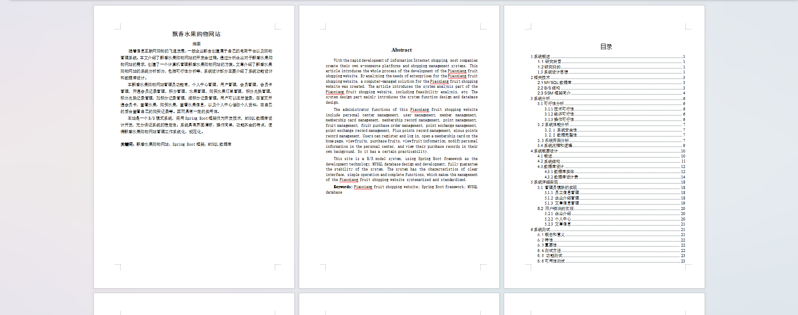
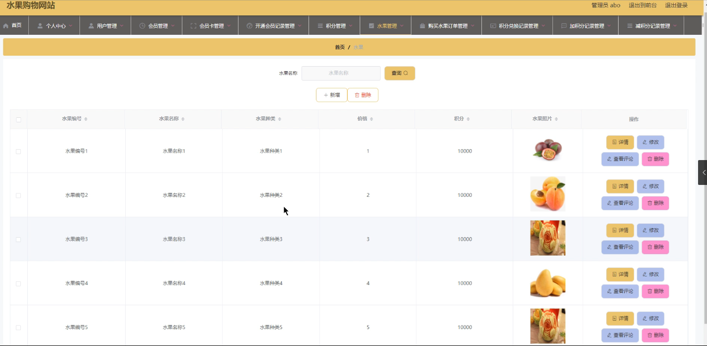
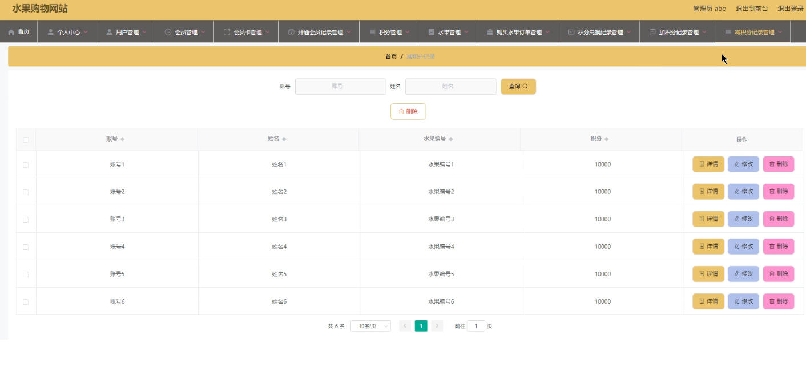
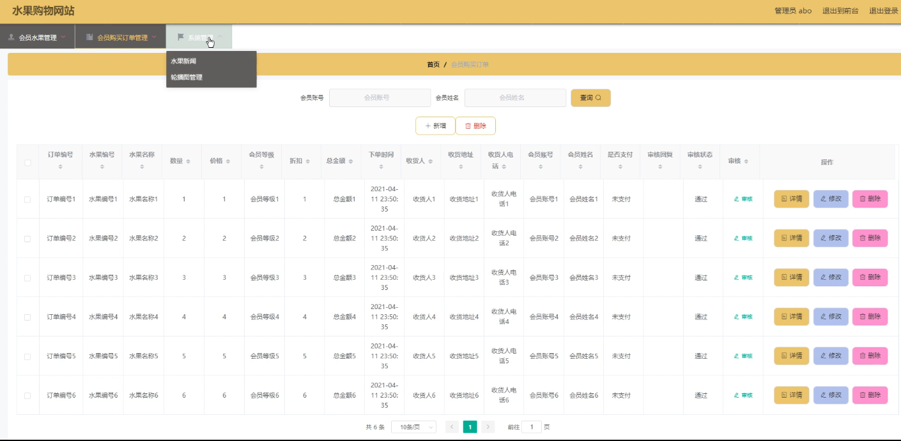
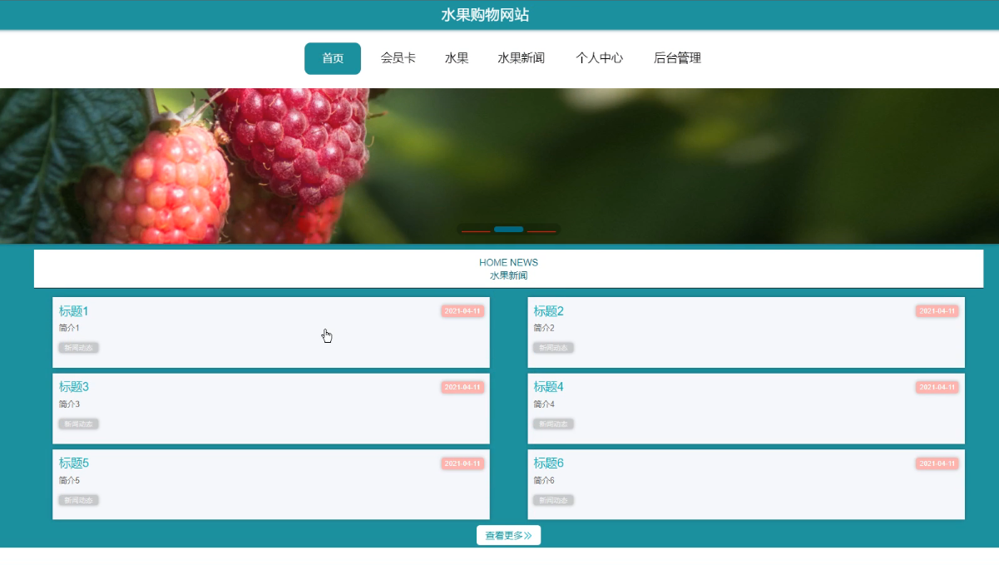
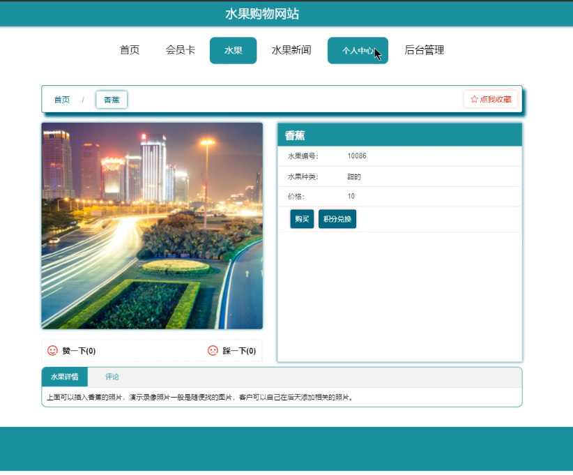
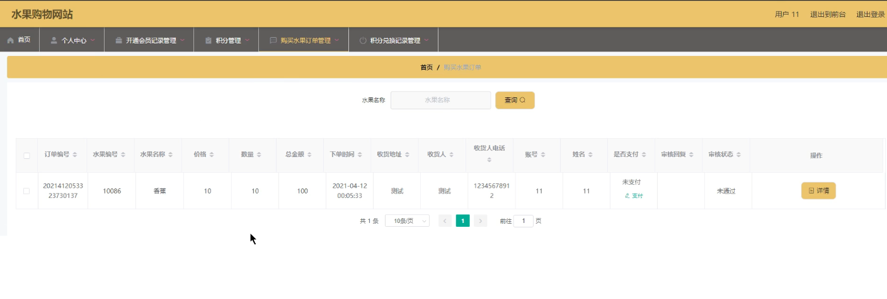

基于Springboot的飘香水果购物网站（程序+论文）
=
### 完整代码获取地址：从戎源码网 ([https://armycodes.com/](https://armycodes.com/))
### 作者微信：19941326836  QQ：952045282 
### 承接计算机毕业设计、Java毕业设计、Python毕业设计、深度学习、机器学习
### 选题+开题报告+任务书+程序定制+安装调试+论文+答辩ppt 一条龙服务
### 所有选题地址https://github.com/nature924/allProject

一、项目介绍
---
系统包含两种角色：用户、管理员，系统分为前台和后台两大模块，主要功能如下：

### 1管理员模块的实现

水果信息管理
飘香水果购物网站的系统管理员可以管理水果，对水果信息进行添加、修改和删除操作。

减积分管理
系统管理员可以对减积分进行添加、修改和删除操作。

会员购买订单管理
系统管理员可以对用户提交的订单进行审核和删除操作。

### 2用户模块的实现

首页
用户登录后，可以查看首页，首页会显示水果新闻。

水果
用户登录后，点击水果，可以查看水果信息并进行购买操作。

购买水果订单管理
用户登录后可以在个人后台查看属于自己的购买水果订单管理。

二、项目技术
---
- 编程语言：Java
- 数据库：MySQL
- 项目管理工具：Maven
- 前端技术：VUE、HTML、Jquery、Bootstrap
- 后端技术：Spring、SpringMVC、MyBatis

三、运行环境
---
- 操作系统：Windows、macOS都可以
- JDK版本：JDK1.8以上都可以
- 开发工具：IDEA、Ecplise、Myecplise都可以
- 数据库: MySQL5.7以上都可以
- Tomcat：任意版本都可以
- Maven：任意版本都可以

四、运行截图
---
### 论文截图：

### 程序截图：

